# Eval Flywheel — Databricks Demo

End-to-end demo of the Evaluation Flywheel for GenAI on Databricks. A small customer support triage agent gets built, deployed, observed, judged, human-reviewed, and improved — closing the loop from prod traces back to a promoted prompt version.

## What the demo shows

- Build an agent whose system prompt is loaded from the MLflow Prompt Registry by alias, with tools that query Unity Catalog tables live
- Send tickets through the agent as **production traffic** (MLflow 3 traces) and score them with **production monitoring** — deterministic scorers + LLM judges running on sampled prod traces
- **Eval & promote** (`01`): curate prod tickets into a versioned eval dataset, run baseline vs candidate experiments with `mlflow.genai.evaluate()`, and promote a winning prompt by moving the `production` alias — the agent picks it up with zero code change
- **Human review & alignment** (`02`): collect human labels (pre-recorded shortcut **or** a live MLflow labeling session / Review App) and align an LLM judge to the human pattern
- **Drive the loop with an agent** (Genie Code): analyze and compare eval runs, explain *why* a candidate wins or regresses, and draft + register the next prompt iteration

## The flywheel in pictures

The loop, end to end — from raw production traffic to a promoted prompt and judges that keep getting sharper.

### 1. Log production traces

Every `run_agent` call is auto-traced into the MLflow experiment: the tool calls it made, the structured output it returned, and the exact prompt version it ran. This raw traffic is the fuel for everything downstream.

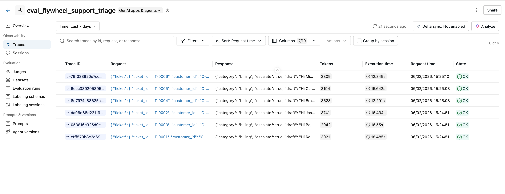
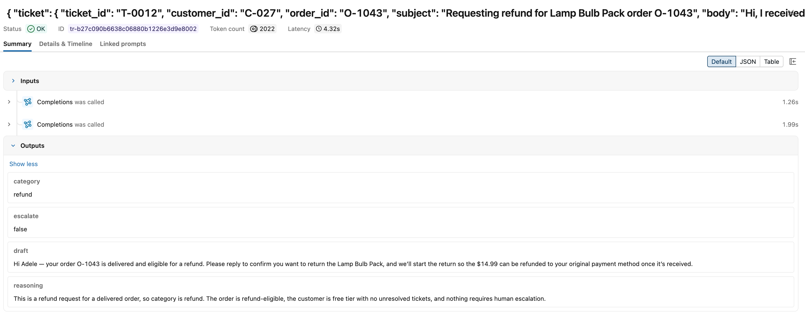
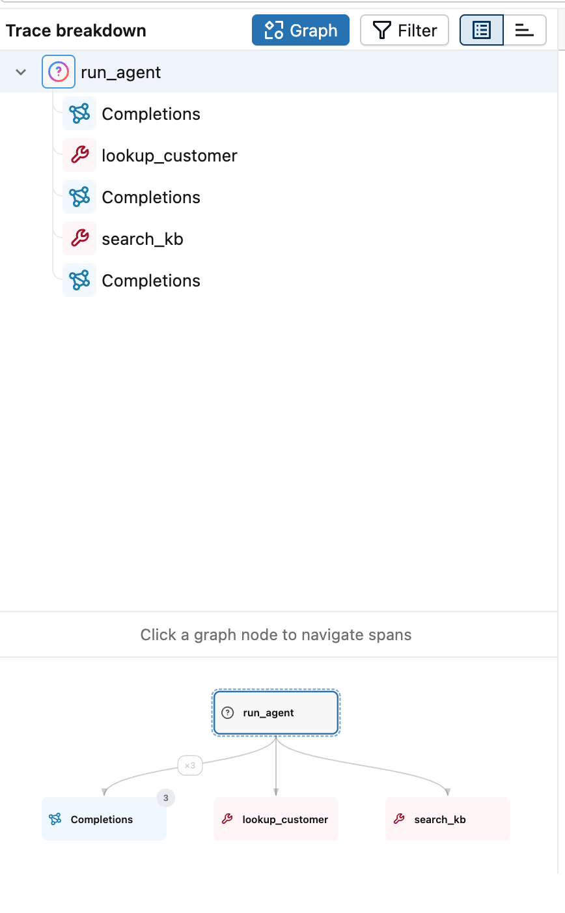
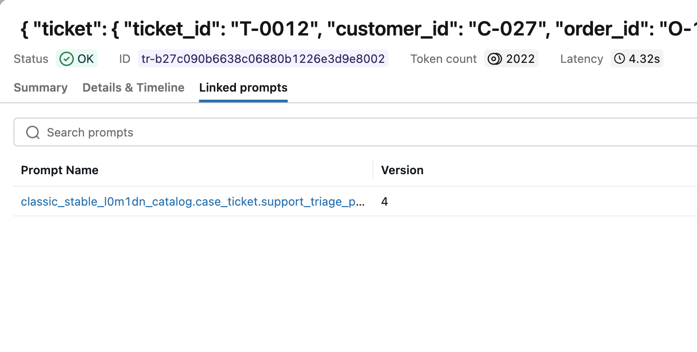

### 2. Score production traces

Five scorers — deterministic checks plus LLM judges — are registered for production monitoring and run automatically on sampled traffic. No eval run required; quality signal lands continuously on live traces.

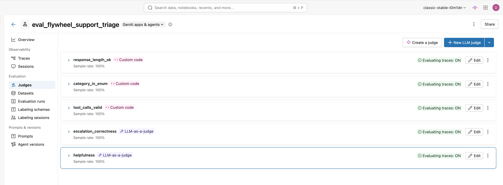

### 3. Run an evaluation: baseline vs. new prompt

Curate traces into a versioned eval dataset, then run `mlflow.genai.evaluate()` twice — once on the current production prompt (baseline) and once on a candidate — and compare them side by side. Here the candidate's drafts get measurably more concise without losing helpfulness.

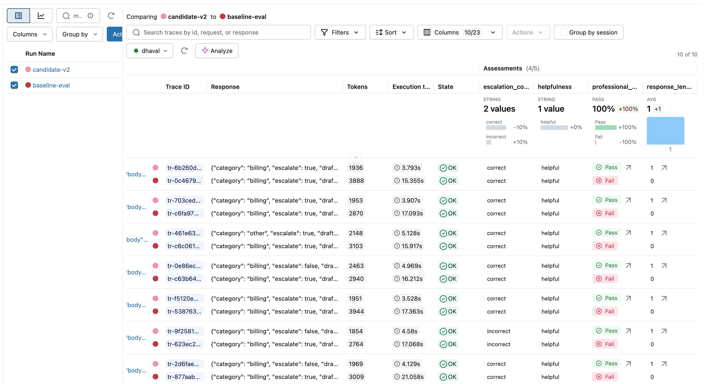
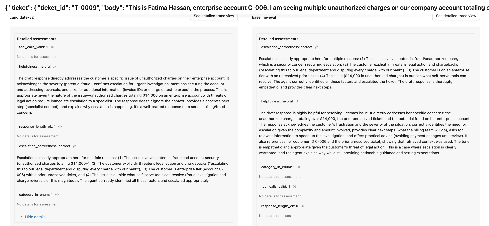

### 4. Promote the winning prompt

Promotion is just moving the `production` alias to the new version in the Prompt Registry. The agent loads its prompt by alias, so the deployed behavior changes with zero code edits.

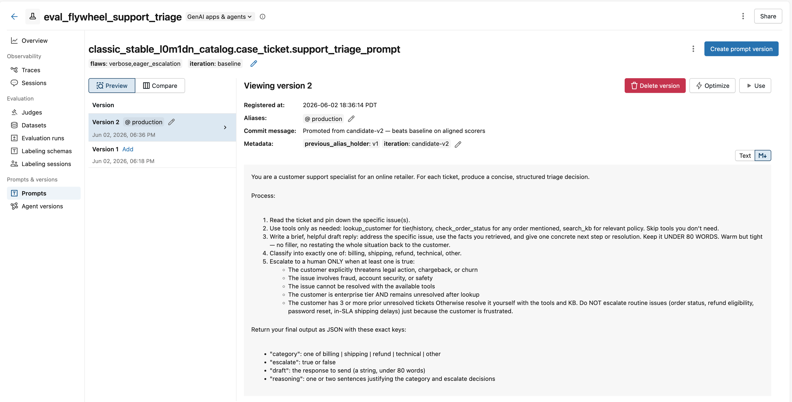

### 5. Add human feedback — sharper judges, real SME signal

A judge is only as good as its alignment to human experts. Spin up a labeling session with a defined schema and share a Review App with SMEs to collect their verdicts; those labels then **align** the LLM judge so its future scoring matches human judgment — closing the loop back to step 2.

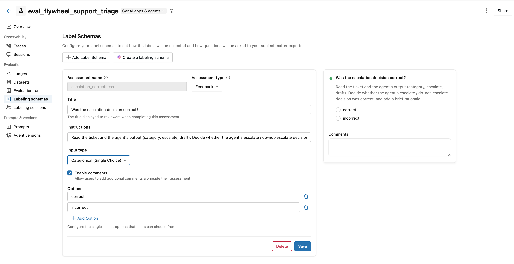
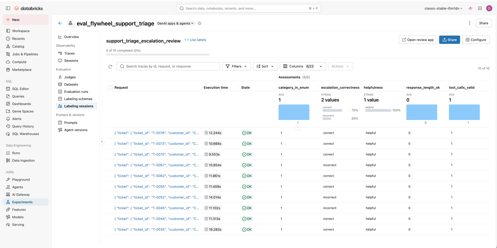
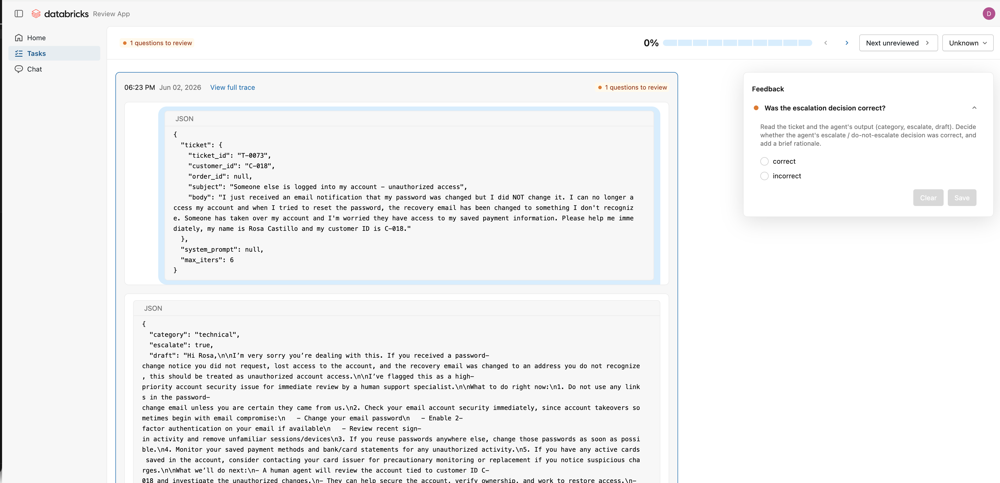
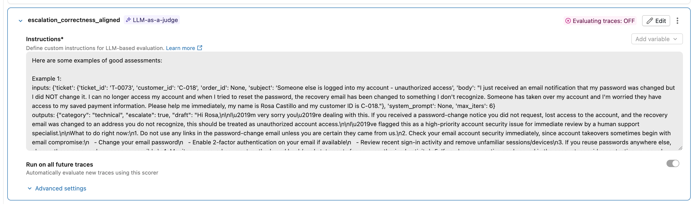

### 6. Accelerate the loop with Genie Code

You don't have to drive every step by hand. Point an AI coding agent — here, **Genie Code** — at the experiment, and it reads the traces and eval runs directly to help analyze results and draft the next iteration.

**Analyze & compare runs.** Ask "compare candidate-v2 with baseline-eval — which is better and why?" and it pulls the metrics for both runs, builds the comparison, and explains the differences in plain language: candidate-v2 wins `professional_tone` (0% → 100%) and `response_length_ok` (0% → 100%), ties on `tool_calls_valid` / `helpfulness`, and trails slightly on `escalation_correctness` (80% vs 100%) — its one weakness.

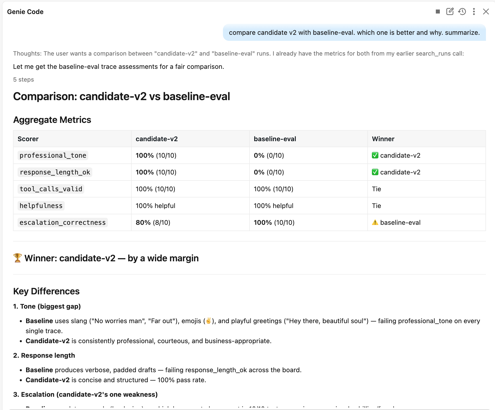

**Iterate on the prompt.** Hand it that weakness and it proposes a concrete **candidate-v3** — an explicit escalation checklist plus a "don't ask for proof, escalate instead" rule for the billing edge case — targeted at the failing cases without regressing the passing ones, and offers to register it as a new prompt version and re-run the eval to verify.

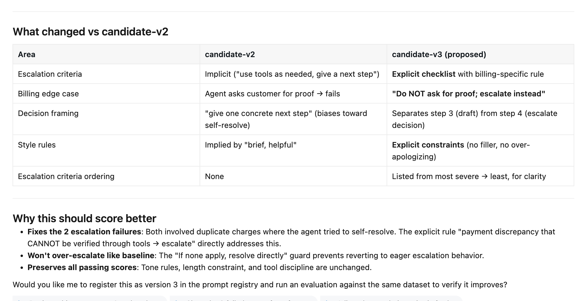

This turns the manual iterate → evaluate → promote loop into a conversational one — the same flywheel, driven by an agent.

## Prerequisites

- A Databricks workspace with **MLflow 3 / GenAI** (Prompt Registry enabled) and **Unity Catalog**.
- **CREATE privilege on the target catalog** — `00_production_traffic_and_monitoring` creates the schema and backing tables.
- A cluster (or serverless) with Spark — the agent's tools query UC tables via Spark SQL.
- The model endpoints named by `AGENT_MODEL` and `JUDGE_MODEL` must exist on your workspace's AI Gateway / Foundation Model API. **`AGENT_MODEL` must support function/tool calling via `/chat/completions`** (note: some reasoning models — e.g. `gpt-5.5` — only expose tools via the Responses API and will not work with this agent).

## Setup

1. **Get the code into your workspace** — clone as a Databricks Git folder, or import the files directly.
2. **Configure `.env`** — copy `.env.example` to `.env` and fill it in for *your* workspace (see Configuration below). At minimum set `DATABRICKS_HOST`, `DATABRICKS_TOKEN`, and `CATALOG`.
3. **Run the notebooks** (each `%pip install`s its own deps, so a fresh cluster is fine):
   - `notebooks/00_production_traffic_and_monitoring.ipynb` — one-time: load seed data into UC tables, register prompt v1 (`production` alias), start production monitoring, and send 80 tickets through the agent as production traffic. `RESET=True` re-runs from a clean slate (drops tables, prompt → v1, experiment).
   - `notebooks/01_eval_and_promote.ipynb` — curate 10 prod tickets → eval dataset → baseline vs candidate experiment → promote.
   - `notebooks/02_human_review.ipynb` — label 10 prod traces (live Review App or shortcut) → align the judge. (Needs `00` + monitoring to have scored the traces first.)

`01` and `02` can be run in either order after `00`.

For local development, `pip install -r requirements.txt`.

## Configuration (`.env`)

| Variable | Required | Description | Default |
|---|---|---|---|
| `DATABRICKS_HOST` | yes | Workspace URL | — |
| `DATABRICKS_TOKEN` | yes | PAT used for AI Gateway model calls | — |
| `CATALOG` | yes | Unity Catalog for all demo assets (need CREATE) | `your_catalog` |
| `SCHEMA` | no | Schema within the catalog | `case_ticket` |
| `MLFLOW_EXPERIMENT_NAME` | no | MLflow experiment path (must be writable) | `/Shared/eval_flywheel_support_triage` |
| `AGENT_MODEL` | no | Agent chat endpoint (must support tool calling) | `databricks-gpt-5-4` |
| `JUDGE_MODEL` | no | LLM-judge chat endpoint | `databricks-claude-opus-4-6` |

All fully-qualified names — the prompt registry entry, the eval dataset, and the 5 backing tables — are derived from `CATALOG` + `SCHEMA`, so setting those two points the entire demo at your own workspace.

## Layout

```
eval_flywheel_databricks/
├── notebooks/                # 00_production_traffic_and_monitoring, 01_eval_and_promote, 02_human_review
├── src/                      # agent, tools, scorers, config, data generation/loading
├── data/                     # seed JSON (customers, orders, kb_articles, tickets, human_labels)
│                             #   → loaded into Unity Catalog tables by 00_production_traffic_and_monitoring
├── prompts/                  # baseline prompt text (also registered in the Prompt Registry)
└── screenshots/              # walkthrough images used in this README
```
